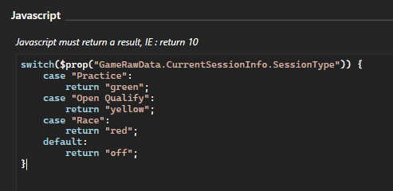

# SimHub MQTT Publisher

This is a fork of [Wotever's MQTT publisher plugin](https://github.com/SHWotever/SimHub-MQTT-Publisher), which allows you to send data from SimHub to an MQTT server.

These improvements focus on reducing message spam and giving you finer control over the payload data.

* Message payload is now based on an NCalc/Javascript expression configurable by the user.
* Publish frequency can be reduced by increasing the "publish interval".
* Messages will only be published if the expression result changes.

---

